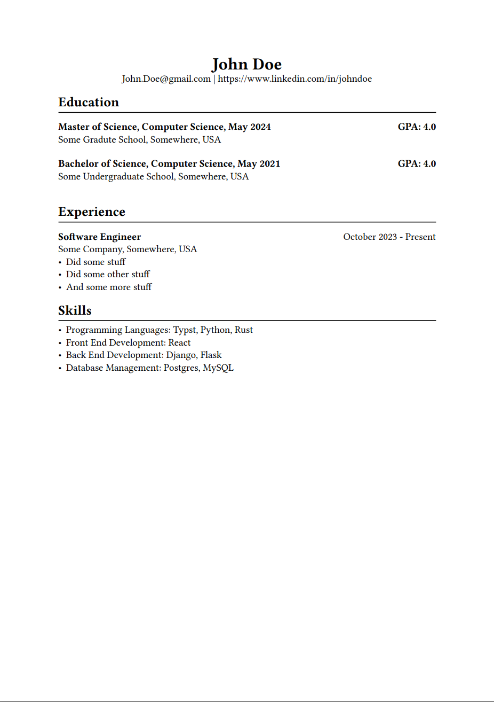

# Typst Resume Template

## Usage

1. Install Typst Cli from [typst](https://github.com/typst/typst)
2. Clone this repo 
    - `git clone https://github.com/MaharshiAJ/Resume-Template`
3. File out the resume.json file with your current resume data
4. Run the following command
    - `typst compile main.typ`

## Making Changes
If you'd like to make changes to the layout, you can edit the main.typ file and rearrange as you see fit. For example, moving the experience section to the top. If you want to add additional sections, add them to your resume.json file, add the section to the template, and call the section in the main.typ file.

## Demo

